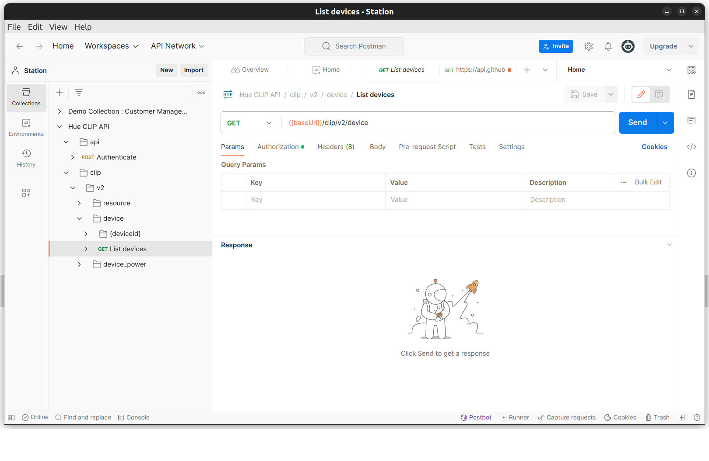

# Les API HTTP REST

- [Les API HTTP REST](#les-api-http-rest)
  - [HTTP](#http)
    - [Présentation](#présentation)
    - [Notion de méthode](#notion-de-méthode)
    - [Manipulations](#manipulations)
  - [URI et URL](#uri-et-url)
  - [API Web](#api-web)
  - [Exemples](#exemples)
    - [Astronomy Picture of the Day](#astronomy-picture-of-the-day)
    - [Star Wars](#star-wars)
    - [IoT](#iot)
  - [REST](#rest)
  - [OpenAPI](#openapi)
  - [Outils](#outils)
    - [CLI](#cli)
    - [Postman](#postman)
  - [Application serveur HTTP](#application-serveur-http)
    - [ESP32](#esp32)
    - [Python](#python)
    - [Node.js](#nodejs)
  - [Application cliente HTTP](#application-cliente-http)
    - [Générateur](#générateur)
    - [Android Java](#android-java)
    - [Qt C++](#qt-c)
    - [Python](#python-1)
  - [Auteurs](#auteurs)

---

## HTTP

### Présentation

[HTTP](https://fr.wikipedia.org/wiki/Hypertext_Transfer_Protocol) (_Hypertext Transfer Protocol_) est un **protocole de communication [client-serveur](https://fr.wikipedia.org/wiki/Client-serveur)** développé pour le [World Wide Web](https://fr.wikipedia.org/wiki/World_Wide_Web) (www).

C'est un protocole de la **couche Application** dans le [modèle OSI](https://fr.wikipedia.org/wiki/Mod%C3%A8le_OSI) à 7 couches et dans le [modèle DoD](https://fr.wikipedia.org/wiki/Suite_des_protocoles_Internet) à 4 couches. On utilise généralement le protocole [TCP](https://fr.wikipedia.org/wiki/Transmission_Control_Protocol) comme couche de [Transport](https://fr.wikipedia.org/wiki/Couche_transport). Un serveur HTTP utilise par défaut le port **TCP 80**.

HTTP est un protocole **orienté caractères**. Les délimiteurs sont l'**espace** (` `) et le **saut de ligne** (`\r\n`).


Comme tous les protocoles, HTTP est décomposé en deux parties : l'**en-tête** (_header_ ou PCI pour _Protocol Control Information_) et les **données**, qui peuvent être vides, (_payload_ ou PDU pour _Protocol Data Unit_)). Les deux parties sont délimitées par une ligne vide (`\r\n`) qui marquent donc la fin de l'en-tête.

### Notion de méthode

Dans le protocole HTTP, une **méthode** est une **commande** spécifiant un **type de requête**, c'est-à-dire qu'elle demande au serveur d'effectuer une action. En général l'action concerne une ressource identifiée par l'[URL](https://fr.wikipedia.org/wiki/Uniform_Resource_Locator) qui suit le nom de la méthode.

Il existe de nombreuses méthodes (`GET`, `HEAD`, `POST`, `PUT`, `DELETE`, ...). Les méthodes GET et POST sont les plus utilisées :

- `GET` : C'est la méthode la plus courante pour demander une ressource. Elle ne contient pas de données mais on peut en passer sous forme de paramètres dans l'URL

Exemples de requêtes `GET` :

```
GET /page.html
GET /index.html?page=42
```

- `POST` : Cette méthode est utilisée pour transmettre des données en vue d'un traitement à une ressource (elle est par exemple utilisée depuis un **formulaire HTML**).

### Manipulations


> [!TIP]
> [netcat](https://fr.wikipedia.org/wiki/Netcat) (ou `nc`) est un utilitaire en ligne de commande permettant de réaliser des communications réseau (client/serveur) en utilisant les protocoles de la couche TRANSPORT UDP ou TCP. En raison de sa polyvalence, netcat est aussi appelé le « couteau suisse du TCP/IP ».

## URI et URL

Un [URI](https://fr.wikipedia.org/wiki/Uniform_Resource_Identifier) (_Uniform Resource Identifier_) est un identifiant d'une ressource sur un réseau sous la forme d'une chaîne de caractères.

Une [URL](https://fr.wikipedia.org/wiki/Uniform_Resource_Locator) (_Uniform Resource Locator_, couramment appelée **adresse web**, est une chaîne de caractères uniforme qui permet d'identifier une ressource du [World Wide Web](https://fr.wikipedia.org/wiki/World_Wide_Web) (www) par son emplacement et de préciser le protocole internet pour la récupérer (par exemple `http` ou `https`). Elle peut localiser divers formats de données : document HTML, image, son ...

> [!NOTE]
> Les URL constituent un sous-ensemble des identifiants uniformes de ressource (Uniform Resource Identifier, URI), identifiants uniques d'accès à une ressource.

La syntaxe respecte une norme d’Internet. Un URI doit permettre d'identifier une ressource de manière permanente, même si la ressource est déplacée ou supprimée.
Une URL est un URI qui décrit son mode d'accès. Par exemple, l'URL http://www.wikipedia.org/ est un URI qui identifie une ressource (page d'accueil Wikipédia) qui peut être obtenue via le protocole HTTP depuis un réseau hôte appelé www.wikipedia.org.

> La syntaxe générale d'une URI est décrite dans la [RFC 3986](https://datatracker.ietf.org/doc/html/rfc3986) qui complète la [RFC 1738](https://datatracker.ietf.org/doc/html/rfc1738) spécifique aux URL.

## API Web

Une [API Web](https://fr.wikipedia.org/wiki/API_Web) est une interface de programmation d'application (API) pour un serveur Web ou un navigateur (client) Web.

Une **API Web côté serveur** est servie au moyen d'un serveur Web basé sur HTTP. Elle se compose d'un ou plusieurs points d'accès exposés publiquement répondant avec des données, généralement exprimé en [XML](https://fr.wikipedia.org/wiki/Extensible_Markup_Language) ou [JSON](https://fr.wikipedia.org/wiki/JavaScript_Object_Notation).

> [!NOTE]
> Les [webhooks](https://fr.wikipedia.org/wiki/Webhook) sont des API Web côté serveur qui prennent en entrée un URI conçu pour être utilisé comme un canal nommé distant ou un type de rappel tel que le serveur agit en tant que client pour déréférencer l'URI fourni et **déclencher un événement sur un autre serveur qui gère cet événement**.

Les points d'accès spécifient où se trouvent les ressources accessibles par les clients. Généralement l'accès se fait via une URI sur laquelle sont postées les requêtes HTTP, et dont la réponse est donc attendue. Les API Web peuvent être publiques ou privées, dans ce cas elles nécessitent un [jeton d'accès](https://fr.wikipedia.org/wiki/Jeton_d%27acc%C3%A8s) (_token_).

Les API Web Web 2.0 utilisent [REST](#rest) et [SOAP](https://fr.wikipedia.org/wiki/SOAP). Les API Web _RESTful_ utilisent des méthodes HTTP pour accéder aux ressources via des paramètres encodés en URL et utilisent JSON ou XML pour transmettre des données. En revanche, les protocoles SOAP sont normalisés par le W3C et imposent l'utilisation de XML.

> [!IMPORTANT]
> Les API Web sont devenues omniprésentes. Il existe peu d'applications/services logiciels majeurs qui n'offrent pas une certaine forme d'API Web. Liens : https://publicapis.io/, https://rapidapi.com/hub, https://developers.google.com/apis-explorer?hl=fr et https://nordicapis.com/13-api-directories-to-help-you-discover-apis/

## Exemples

### Astronomy Picture of the Day

Un exemple d'API Web populaire est l'API Astronomy Picture of the Day exploitée par l'agence spatiale américaine NASA. Il s'agit d'une API côté serveur utilisée pour récupérer des photographies de l'espace ou d'autres images d'intérêt pour les astronomes, ainsi que des métadonnées sur les images.

L'API Web a un point de terminaison : `https://api.nasa.gov/planetary/apod`

Ce point de terminaison accepte les requêtes GET : `https://api.nasa.gov/planetary/apod?api_key=DEMO_KEY&date=1996-12-03`

Les paramètres de cette API sont écrits dans un format connu sous le nom de **chaîne de requête**, qui est séparé par un point d'interrogation (`?`) du point de terminaison. Une esperluette (`&`) sépare les paramètres de la chaîne de requête les uns des autres. Ensemble, le point de terminaison et la chaîne de requête forment une URL qui détermine la manière dont l'API répondra. Cette URL est également connue sous le nom de **requête** ou d'**appel d'API**.

Cette requête GET affiche à l'utilisateur un résultat (ici en [JSON](https://fr.wikipedia.org/wiki/JavaScript_Object_Notation)) appelé **valeur de retour**.

```json
{
 "date":"1996-12-03",
 "explanation":"Like a butterfly,\r a white dwarf star begins its life\r by casting off a cocoon that enclosed its former self. In this\r analogy, however, the Sun would be\r a caterpillar\r and the ejected shell of gas would become the prettiest of all!\r The above cocoon, the planetary nebula\r designated NGC 2440, contains one of the hottest white dwarf stars known.\r The white dwarf can be seen as the bright dot near the photo's\r center. Our Sun will eventually become a \"white dwarf butterfly\",\r but not for another 5 billion years. The above false color image recently entered the public domain\r and was post-processed by F. Hamilton.\r",
 "hdurl":"https://apod.nasa.gov/apod/image/9612/ngc2440_hst2_big.jpg",
 "media_type":"image",
 "service_version":"v1",
 "title":"Cocoon of a New White Dwarf\r\nCredit:",
 "url":"https://apod.nasa.gov/apod/image/9612/ngc2440_hst2.jpg"
}
```

### Star Wars

Bienvenue sur [swapi](https://swapi.dev/), l'API Star Wars ! [swapi.dev](https://swapi.dev/) est une API complètement ouverte sans aucune authentification pour interroger et obtenir des données.

L'URL racine de l'API est : `https://swapi.dev/api/`

Documentation : https://swapi.dev/documentation

```bash
$ curl -k --location https://swapi.dev/api/people/1/
{"name":"Luke Skywalker","height":"172","mass":"77","hair_color":"blond","skin_color":"fair","eye_color":"blue","birth_year":"19BBY","gender":"male","homeworld":"https://swapi.dev/api/planets/1/","films":["https://swapi.dev/api/films/1/","https://swapi.dev/api/films/2/","https://swapi.dev/api/films/3/","https://swapi.dev/api/films/6/"],"species":[],"vehicles":["https://swapi.dev/api/vehicles/14/","https://swapi.dev/api/vehicles/30/"],"starships":["https://swapi.dev/api/starships/12/","https://swapi.dev/api/starships/22/"],"created":"2014-12-09T13:50:51.644000Z","edited":"2014-12-20T21:17:56.891000Z","url":"https://swapi.dev/api/people/1/"}
```

### IoT

- Gestion d'un éclairage connecté Philips Hue : [API Philips Hue REST](https://github.com/bts-lasalle-avignon-ressources/PhilipsHue) (HTTPS)
- Gestion d'une prise électrique : [API REST myStrom](https://github.com/bts-lasalle-avignon-ressources/myStrom) (HTTP)

## REST

[REST](https://fr.wikipedia.org/wiki/Representational_state_transfer) (_REpresentational State Transfer_) est un style d'architecture logicielle définissant un ensemble de contraintes à utiliser pour créer des [services web](https://fr.wikipedia.org/wiki/Service_web).

Les services web conformes au style d'architecture REST sont nommés **services web RESTful**.

Les services web REST permettent aux systèmes effectuant des requêtes de manipuler des ressources web via leurs représentations textuelles à travers un ensemble d'opérations uniformes et prédéfinies sans état.

Dans un service web REST, les requêtes effectuées sur l'URI d'une ressource produisent une réponse dont le corps est formaté en [HTML](https://fr.wikipedia.org/wiki/Hypertext_Markup_Language), [XML](https://fr.wikipedia.org/wiki/Extensible_Markup_Language), [JSON](https://fr.wikipedia.org/wiki/JavaScript_Object_Notation) ou un autre format.

Lorsque le protocole [HTTP](https://fr.wikipedia.org/wiki/Hypertext_Transfer_Protocol) est utilisé, comme c'est souvent le cas, les méthodes HTTP généralement utilisées sont `GET` , `PUT`, `DELETE` et `POST`.

La communication client-serveur s'effectue sans conservation de l'état de la session de communication sur le serveur entre deux requêtes successives. Les requêtes du client contiennent donc toute l'information nécessaire pour que le serveur puisse y répondre.

Les API REST basées sur HTTP sont définies par8 :

- un **URI** de base, comme `http://api.example.com/collection/` ;
- des **méthodes HTTP** standards (par exemple : `GET`, `POST`, `PUT`, `PATCH` et `DELETE`) ;
- un **type de médias** pour les **données** permettant une transition d'état (par exemple : `application/vnd.collection+json` pour [API JSON](https://jsonapi.org/), etc.).

Le tableau suivant indique comment les méthodes HTTP sont généralement utilisées dans une API REST :

URI;GET;POST;PUT;PATCH;DELETE
`http://api.exemple.com/collection/`;Récupère les URI des ressources membres de la ressource collection dans le corps de la réponse.;Crée une ressource membre dans la ressource collection en utilisant les instructions du corps de la requête.;Remplace toutes les représentations des ressources membres de la ressource collection par la représentation dans le corps de la requête, ou crée la ressource collection si elle n'existe pas.;Met à jour toutes les représentations des ressources membres de la ressource collection en utilisant les instructions du corps de la requête;Supprime toutes les représentations des ressources membres de la ressource collection.
`http://api.exemple.com/collection/item3`;Récupère une représentation de la ressource membre dans le corps de la réponse.;Crée une ressource membre dans la ressource membre en utilisant les instructions du corps de la requête.;Remplace toutes les représentations de la ressource membre, ou crée la ressource membre si elle n'existe pas, par la représentation dans le corps de la requête.;Met à jour toutes les représentations de la ressource membre, ou crée éventuellement la ressource membre;Supprime toutes les représentations de la ressource membre.

> [!CAUTION]
> Il n'y a pas de norme officielle pour les API REST, parce que REST est une architecture et non un protocole.

## OpenAPI

[OpenAPI](https://swagger.io/specification/) est une norme de description des API HTTP conformes à l’architecture REST. 

> La spécification OpenAPI actuelle découle d’un projet antérieur nommé [Swagger](https://swagger.io/) (cf. https://www.ionos.fr/digitalguide/sites-internet/developpement-web/quest-ce-que-openapi/).


## Outils

### CLI

Il est évidemment possible d'interagir avec une API Web tout simplement avec les commandes `curl` ou `wget`.

### Postman

[Postman](https://fr.wikipedia.org/wiki/Postman_(logiciel)) est une plateforme pour la construction, l'utilisation et les tests d'API Web.

Lien : https://www.postman.com/

Télécharger et installer la version de [Postman](https://dl.pstmn.io/download/latest/linux_64) pour Linux : https://dl.pstmn.io/download/latest/linux_64

Ou à partir du gestionnaire de paquets _snap_ :

```bash
$ sudo snap install postman
```




> Créer un compte si besoin.

Il existe aussi un outil en ligne de commande Postman CLI :

```bash
$ curl -o- "https://dl-cli.pstmn.io/install/linux64.sh" | sh
```

Et il existe une extension pour Visual Studio Code : https://marketplace.visualstudio.com/items?itemName=Postman.postman-for-vscode

> Voir aussi : [bruno](https://www.usebruno.com/), https://hevodata.com/learn/rest-clients/, ...

## Application serveur HTTP

### ESP32

### Python

### Node.js

## Application cliente HTTP

Pour faire simple, cela revient à émettre des requêtes HTTP et le plus souvent à traiter du JSON.

### Générateur

Des utilitaires comme [Postman](https://www.postman.com/) fournissent des extraits de code à réutiliser :


Par exemple pour Java :


Il existe aussi [OpenAPI Generator](https://github.com/OpenAPITools/openapi-generator-cli) qui permet la génération de bibliothèques clientes d'API HTTP avec une spécification [OpenAPI](https://swagger.io/specification/).

> [OpenAPI](https://swagger.io/specification/) est une norme de description des API HTTP conformes à l’architecture REST. La spécification OpenAPI actuelle découle d’un projet antérieur nommé [Swagger](https://swagger.io/) (cf. https://www.ionos.fr/digitalguide/sites-internet/developpement-web/quest-ce-que-openapi/).

Liens :

- https://github.com/OpenAPITools/openapi-generator-cli
- https://openapi-generator.tech/docs/installation/

Instalation :

```bash
$ npm install -g @openapitools/openapi-generator-cli

npx openapi-generator-cli version
Did set selected version to 7.1.0
7.1.0
```

Génération de code Python :

```bash
$ npx @openapitools/openapi-generator-cli generate -g python -i https://api.redocly.com/registry/bundle/openhue/openhue/v2/openapi.yaml -o my-openhue-project
```

### Android Java

Pour émettre des requêtes HTTP sous Android, il y a plusieurs possibilités. Par exemple :

- le client [OkHttp](https://square.github.io/okhttp/)
- le [client HTTP](https://cloud.google.com/java/docs/reference/google-http-client/latest/com.google.api.client.http) de l'API Google

Exemples d'applications Android :

- Gestion d'un éclairage connecté Philips Hue : [API Philips Hue REST](https://github.com/bts-lasalle-avignon-ressources/PhilipsHue) (HTTPS)
- Gestion d'une prise électrique : [API REST myStrom](https://github.com/bts-lasalle-avignon-ressources/myStrom) (HTTP)

### Qt C++

Pour émettre des requêtes HTTP sous Qt, il faudra utiliser la classe [QNetworkAccessManager](https://doc.qt.io/qt-6/qnetworkaccessmanager.html) du module `network`.

Exemples d'applications Qt :

- Gestion d'un éclairage connecté Philips Hue : [API Philips Hue REST](https://github.com/bts-lasalle-avignon-ressources/PhilipsHue) (HTTPS)
- Gestion d'une prise électrique : [API REST myStrom](https://github.com/bts-lasalle-avignon-ressources/myStrom) (HTTP)

### Python

- Avec `http.client` :

```python
import http.client

conn = http.client.HTTPSConnection("192.168.52.187")
payload = ''
headers = {
  'Accept': 'application/json',
  'hue-application-key': 'XXXXXXXXXXXXXXXXXXXXXXXXXXXXXXXXXXXXXXXX'
}
conn.request("GET", "/clip/v2/resource/light/f9a9b376-6738-4bd1-81ce-021e2ee56a82", payload, headers)
res = conn.getresponse()
data = res.read()
print(data.decode("utf-8"))
```

- Avec `requests` :

```python
import requests

url = "https://187/clip/v2/resource/light/f9a9b376-6738-4bd1-81ce-021e2ee56a82"

payload = {}
headers = {
  'Accept': 'application/json',
  'hue-application-key': 'XXXXXXXXXXXXXXXXXXXXXXXXXXXXXXXXXXXXXXXX'
}

response = requests.request("GET", url, headers=headers, data=payload)

print(response.text)
```

## Auteurs

- [Thierry VAIRA](thierry.vaira@gmail.com) : [tvaira.free.fr](http://tvaira.free.fr/)

---
©️ 2023 BTS LaSalle Avignon
