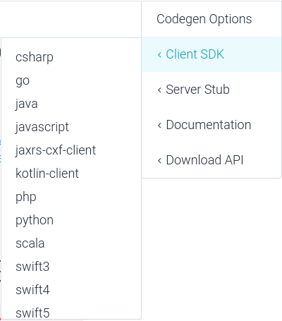

# Les API HTTP REST

- [Les API HTTP REST](#les-api-http-rest)
  - [HTTP](#http)
    - [Présentation](#présentation)
    - [Notion de méthode](#notion-de-méthode)
    - [Manipulations](#manipulations)
  - [URI et URL](#uri-et-url)
  - [API Web](#api-web)
  - [Exemples](#exemples)
    - [Astronomy Picture of the Day](#astronomy-picture-of-the-day)
    - [Star Wars](#star-wars)
    - [IoT](#iot)
  - [REST](#rest)
  - [OpenAPI](#openapi)
    - [Exemple pour un IoT ESP32](#exemple-pour-un-iot-esp32)
    - [SwaggerHub](#swaggerhub)
  - [Générateur](#générateur)
    - [Swagger Editor](#swagger-editor)
    - [Postman](#postman)
    - [OpenAPI Generator](#openapi-generator)
    - [SwaggerHub](#swaggerhub-1)
    - [Swagger Codegen](#swagger-codegen)
  - [Application serveur HTTP](#application-serveur-http)
    - [ESP32](#esp32)
      - [Serveur web](#serveur-web)
      - [Tests CLI avec `curl`](#tests-cli-avec-curl)
      - [Tests avec Postman](#tests-avec-postman)
    - [Python](#python)
    - [Node.js](#nodejs)
  - [Application cliente HTTP](#application-cliente-http)
    - [Android Java](#android-java)
    - [Qt C++](#qt-c)
    - [Python](#python-1)
  - [Auteurs](#auteurs)

---

## HTTP

### Présentation

[HTTP](https://fr.wikipedia.org/wiki/Hypertext_Transfer_Protocol) (_Hypertext Transfer Protocol_) est un **protocole de communication [client-serveur](https://fr.wikipedia.org/wiki/Client-serveur)** développé pour le [World Wide Web](https://fr.wikipedia.org/wiki/World_Wide_Web) (www).

C'est un protocole de la **couche Application** dans le [modèle OSI](https://fr.wikipedia.org/wiki/Mod%C3%A8le_OSI) à 7 couches et dans le [modèle DoD](https://fr.wikipedia.org/wiki/Suite_des_protocoles_Internet) à 4 couches. On utilise généralement le protocole [TCP](https://fr.wikipedia.org/wiki/Transmission_Control_Protocol) comme couche de [Transport](https://fr.wikipedia.org/wiki/Couche_transport). Un serveur HTTP utilise par défaut le port **TCP 80**.

HTTP est un protocole **orienté caractères**. Les délimiteurs sont l'**espace** (` `) et le **saut de ligne** (`\r\n`).


Comme tous les protocoles, HTTP est décomposé en deux parties : l'**en-tête** (_header_ ou PCI pour _Protocol Control Information_) et les **données**, qui peuvent être vides, (_payload_ ou PDU pour _Protocol Data Unit_)). Les deux parties sont délimitées par une ligne vide (`\r\n`) qui marquent donc la fin de l'en-tête.

### Notion de méthode

Dans le protocole HTTP, une **méthode** est une **commande** spécifiant un **type de requête**, c'est-à-dire qu'elle demande au serveur d'effectuer une action. En général l'action concerne une ressource identifiée par l'[URL](https://fr.wikipedia.org/wiki/Uniform_Resource_Locator) qui suit le nom de la méthode.

Il existe de nombreuses méthodes (`GET`, `HEAD`, `POST`, `PUT`, `DELETE`, ...). Les méthodes GET et POST sont les plus utilisées :

- `GET` : C'est la méthode la plus courante pour demander une ressource. Elle ne contient pas de données mais on peut en passer sous forme de paramètres dans l'URL

Exemples de requêtes `GET` :

```
GET /page.html
GET /index.html?page=42
```

- `POST` : Cette méthode est utilisée pour transmettre des données en vue d'un traitement à une ressource (elle est par exemple utilisée depuis un **formulaire HTML**).

### Manipulations


> [!TIP]
> [netcat](https://fr.wikipedia.org/wiki/Netcat) (ou `nc`) est un utilitaire en ligne de commande permettant de réaliser des communications réseau (client/serveur) en utilisant les protocoles de la couche TRANSPORT UDP ou TCP. En raison de sa polyvalence, netcat est aussi appelé le « couteau suisse du TCP/IP ».

## URI et URL

Un [URI](https://fr.wikipedia.org/wiki/Uniform_Resource_Identifier) (_Uniform Resource Identifier_) est un identifiant d'une ressource sur un réseau sous la forme d'une chaîne de caractères.

Une [URL](https://fr.wikipedia.org/wiki/Uniform_Resource_Locator) (_Uniform Resource Locator_, couramment appelée **adresse web**, est une chaîne de caractères uniforme qui permet d'identifier une ressource du [World Wide Web](https://fr.wikipedia.org/wiki/World_Wide_Web) (www) par son emplacement et de préciser le protocole internet pour la récupérer (par exemple `http` ou `https`). Elle peut localiser divers formats de données : document HTML, image, son ...

> [!NOTE]
> Les URL constituent un sous-ensemble des identifiants uniformes de ressource (Uniform Resource Identifier, URI), identifiants uniques d'accès à une ressource.

La syntaxe respecte une norme d’Internet. Un URI doit permettre d'identifier une ressource de manière permanente, même si la ressource est déplacée ou supprimée.
Une URL est un URI qui décrit son mode d'accès. Par exemple, l'URL http://www.wikipedia.org/ est un URI qui identifie une ressource (page d'accueil Wikipédia) qui peut être obtenue via le protocole HTTP depuis un réseau hôte appelé www.wikipedia.org.

> La syntaxe générale d'une URI est décrite dans la [RFC 3986](https://datatracker.ietf.org/doc/html/rfc3986) qui complète la [RFC 1738](https://datatracker.ietf.org/doc/html/rfc1738) spécifique aux URL.

## API Web

Une [API Web](https://fr.wikipedia.org/wiki/API_Web) est une interface de programmation d'application (API) pour un serveur Web ou un navigateur (client) Web.

Une **API Web côté serveur** est servie au moyen d'un serveur Web basé sur HTTP. Elle se compose d'un ou plusieurs points d'accès exposés publiquement répondant avec des données, généralement exprimé en [XML](https://fr.wikipedia.org/wiki/Extensible_Markup_Language) ou [JSON](https://fr.wikipedia.org/wiki/JavaScript_Object_Notation).

> [!NOTE]
> Les [webhooks](https://fr.wikipedia.org/wiki/Webhook) sont des API Web côté serveur qui prennent en entrée un URI conçu pour être utilisé comme un canal nommé distant ou un type de rappel tel que le serveur agit en tant que client pour déréférencer l'URI fourni et **déclencher un événement sur un autre serveur qui gère cet événement**.

Les points d'accès spécifient où se trouvent les ressources accessibles par les clients. Généralement l'accès se fait via une URI sur laquelle sont postées les requêtes HTTP, et dont la réponse est donc attendue. Les API Web peuvent être publiques ou privées, dans ce cas elles nécessitent un [jeton d'accès](https://fr.wikipedia.org/wiki/Jeton_d%27acc%C3%A8s) (_token_).

Les API Web Web 2.0 utilisent [REST](#rest) et [SOAP](https://fr.wikipedia.org/wiki/SOAP). Les API Web _RESTful_ utilisent des méthodes HTTP pour accéder aux ressources via des paramètres encodés en URL et utilisent JSON ou XML pour transmettre des données. En revanche, les protocoles SOAP sont normalisés par le W3C et imposent l'utilisation de XML.

> [!IMPORTANT]
> Les API Web sont devenues omniprésentes. Il existe peu d'applications/services logiciels majeurs qui n'offrent pas une certaine forme d'API Web. Liens : https://publicapis.io/, https://rapidapi.com/hub, https://developers.google.com/apis-explorer?hl=fr et https://nordicapis.com/13-api-directories-to-help-you-discover-apis/

## Exemples

### Astronomy Picture of the Day

Un exemple d'API Web populaire est l'API Astronomy Picture of the Day exploitée par l'agence spatiale américaine NASA. Il s'agit d'une API côté serveur utilisée pour récupérer des photographies de l'espace ou d'autres images d'intérêt pour les astronomes, ainsi que des métadonnées sur les images.

L'API Web a un point de terminaison : `https://api.nasa.gov/planetary/apod`

Ce point de terminaison accepte les requêtes GET : `https://api.nasa.gov/planetary/apod?api_key=DEMO_KEY&date=1996-12-03`

Les paramètres de cette API sont écrits dans un format connu sous le nom de **chaîne de requête**, qui est séparé par un point d'interrogation (`?`) du point de terminaison. Une esperluette (`&`) sépare les paramètres de la chaîne de requête les uns des autres. Ensemble, le point de terminaison et la chaîne de requête forment une URL qui détermine la manière dont l'API répondra. Cette URL est également connue sous le nom de **requête** ou d'**appel d'API**.

Cette requête GET affiche à l'utilisateur un résultat (ici en [JSON](https://fr.wikipedia.org/wiki/JavaScript_Object_Notation)) appelé **valeur de retour**.

```json
{
 "date":"1996-12-03",
 "explanation":"Like a butterfly,\r a white dwarf star begins its life\r by casting off a cocoon that enclosed its former self. In this\r analogy, however, the Sun would be\r a caterpillar\r and the ejected shell of gas would become the prettiest of all!\r The above cocoon, the planetary nebula\r designated NGC 2440, contains one of the hottest white dwarf stars known.\r The white dwarf can be seen as the bright dot near the photo's\r center. Our Sun will eventually become a \"white dwarf butterfly\",\r but not for another 5 billion years. The above false color image recently entered the public domain\r and was post-processed by F. Hamilton.\r",
 "hdurl":"https://apod.nasa.gov/apod/image/9612/ngc2440_hst2_big.jpg",
 "media_type":"image",
 "service_version":"v1",
 "title":"Cocoon of a New White Dwarf\r\nCredit:",
 "url":"https://apod.nasa.gov/apod/image/9612/ngc2440_hst2.jpg"
}
```

### Star Wars

Bienvenue sur [swapi](https://swapi.dev/), l'API Star Wars ! [swapi.dev](https://swapi.dev/) est une API complètement ouverte sans aucune authentification pour interroger et obtenir des données.

L'URL racine de l'API est : `https://swapi.dev/api/`

Documentation : https://swapi.dev/documentation

```bash
$ curl -k --location https://swapi.dev/api/people/1/
{"name":"Luke Skywalker","height":"172","mass":"77","hair_color":"blond","skin_color":"fair","eye_color":"blue","birth_year":"19BBY","gender":"male","homeworld":"https://swapi.dev/api/planets/1/","films":["https://swapi.dev/api/films/1/","https://swapi.dev/api/films/2/","https://swapi.dev/api/films/3/","https://swapi.dev/api/films/6/"],"species":[],"vehicles":["https://swapi.dev/api/vehicles/14/","https://swapi.dev/api/vehicles/30/"],"starships":["https://swapi.dev/api/starships/12/","https://swapi.dev/api/starships/22/"],"created":"2014-12-09T13:50:51.644000Z","edited":"2014-12-20T21:17:56.891000Z","url":"https://swapi.dev/api/people/1/"}
```

### IoT

- Gestion d'un éclairage connecté Philips Hue : [API Philips Hue REST](https://github.com/bts-lasalle-avignon-ressources/PhilipsHue) (HTTPS)
- Gestion d'une prise électrique : [API REST myStrom](https://github.com/bts-lasalle-avignon-ressources/myStrom) (HTTP)

## REST

[REST](https://fr.wikipedia.org/wiki/Representational_state_transfer) (_REpresentational State Transfer_) est un style d'architecture logicielle définissant un ensemble de contraintes à utiliser pour créer des [services web](https://fr.wikipedia.org/wiki/Service_web).

Les services web conformes au style d'architecture REST sont nommés **services web RESTful**.

Les services web REST permettent aux systèmes effectuant des requêtes de manipuler des ressources web via leurs représentations textuelles à travers un ensemble d'opérations uniformes et prédéfinies sans état.

Dans un service web REST, les requêtes effectuées sur l'URI d'une ressource produisent une réponse dont le corps est formaté en [HTML](https://fr.wikipedia.org/wiki/Hypertext_Markup_Language), [XML](https://fr.wikipedia.org/wiki/Extensible_Markup_Language), [JSON](https://fr.wikipedia.org/wiki/JavaScript_Object_Notation) ou un autre format.

Lorsque le protocole [HTTP](https://fr.wikipedia.org/wiki/Hypertext_Transfer_Protocol) est utilisé, comme c'est souvent le cas, les méthodes HTTP généralement utilisées sont `GET` , `PUT`, `DELETE` et `POST`.

La communication client-serveur s'effectue sans conservation de l'état de la session de communication sur le serveur entre deux requêtes successives. Les requêtes du client contiennent donc toute l'information nécessaire pour que le serveur puisse y répondre.

Les API REST basées sur HTTP sont définies par8 :

- un **URI** de base, comme `http://api.example.com/collection/` ;
- des **méthodes HTTP** standards (par exemple : `GET`, `POST`, `PUT`, `PATCH` et `DELETE`) ;
- un **type de médias** pour les **données** permettant une transition d'état (par exemple : `application/json` ou `application/vnd.collection+json` pour [API JSON](https://jsonapi.org/), etc.).

Le tableau suivant indique comment les méthodes HTTP sont généralement utilisées dans une API REST :

|URI|GET|POST|PUT|PATCH|DELETE|
|---|---|---|---|---|---|
|`http://api.exemple.com/collection/`|Récupère les URI des ressources membres de la ressource `collection` dans le corps de la réponse.|Crée une ressource membre dans la ressource `collection` en utilisant les instructions du corps de la requête.|Remplace toutes les représentations des ressources membres de la ressource `collection` par la représentation dans le corps de la requête ou crée la ressource `collection` si elle n'existe pas.|Met à jour toutes les représentations des ressources membres de la ressource `collection` en utilisant les instructions du corps de la requête|Supprime toutes les représentations des ressources membres de la ressource `collection`.|
|`http://api.exemple.com/collection/item3`|Récupère une représentation de la ressource membre dans le corps de la réponse.|Crée une ressource membre dans la ressource membre en utilisant les instructions du corps de la requête.|Remplace toutes les représentations de la ressource membre ou crée la ressource membre si elle n'existe pas par la représentation dans le corps de la requête.|Met à jour toutes les représentations de la ressource membre ou crée éventuellement la ressource membre|Supprime toutes les représentations de la ressource membre.|

> [!CAUTION]
> Il n'y a pas de norme officielle pour les API REST, parce que REST est une architecture et non un protocole.

## OpenAPI

[OpenAPI](https://swagger.io/specification/) est une norme de description des API HTTP conformes à l’architecture REST. 

> La spécification OpenAPI v3 actuelle découle d’un projet antérieur nommé [Swagger](https://swagger.io/) jusqu'à la v2.

Spécifications : https://swagger.io/specification/ et sa documentation : https://swagger.io/docs/specification/about/

À partir d'une spécification d'API, il est possible :

- d'obtenir une documentation : http://swagger.io/swagger-ui/, ...
- de générer le code (client/serveur) : http://swagger.io/swagger-codegen/, ...

Il est possible d'écrire la spécification de l'API en [JSON](https://fr.wikipedia.org/wiki/JavaScript_Object_Notation) dans un fichier `swagger.json` ou en [YAML](https://fr.wikipedia.org/wiki/YAML) dans un fichier `openapi.yaml`.

Pour cela, on peut utiliser l'[éditeur en ligne](http://editor.swagger.io/) : http://editor.swagger.io/.

> [Swagger UI](http://swagger.io/swagger-ui/) peut être utilisé en local sur la machine : https://swagger.io/docs/open-source-tools/swagger-editor/

La structure de base du fichier possède notamment les propriétés suivantes :

- `openapi` : indique la version des spécifications utilisées
- `info` : décrit des informations (métadonnées) sur l'API
- `servers` : définit les paramètres, comme l'[URL](https://fr.wikipedia.org/wiki/Uniform_Resource_Locator) de base, du (ou des) serveur(s)
- `paths` : définit les [URL](https://fr.wikipedia.org/wiki/Uniform_Resource_Locator)s et les opérations de l'API (`get`, `post`, ...)
- `components` : contient un ensemble d’objets réutilisables et explicitement référencés à partir des propriétés définies dans `paths`

### Exemple pour un IoT ESP32

L'exemple de base présenté ici tourne autour d'un [ESP32](https://fr.wikipedia.org/wiki/ESP32). On souhaite définir une API REST pour gérer des Leds rouges et vertes reliées sur les broches [GPIO](https://fr.wikipedia.org/wiki/General_Purpose_Input/Output).

> La spécification complète : [specifications/openapi-v1.yaml](./specifications/openapi-v1.yaml)

On commence par définir les propriétés `openapi` et `info` :

```yaml
openapi: 3.0.3
info:
  title: API Exemple ESP32
  version: "1.0"
  description: Voir [api-http-rest](https://github.com/bts-lasalle-avignon-ressources/api-http-rest)
  contact:
    name: OpenExempleESP32
    email: tvaira@free.fr
    url: http://tvaira.free.fr
  license:
    name: Apache 2.0
    url: https://www.apache.org/licenses/LICENSE-2.0.html
```

Puis, on définit 3 serveurs dans la propriété `servers` :

```yaml
...
servers:
  - url: http://{adresseIPESP32}
    description: L'IoT ESP32
    variables:
      adresseIPESP32:
        default: 192.168.0.1
        description: |
          Aller sur http://iot-esp32.local/
  - url: http://localhost:5000
    description: Test en Python et Node.js
  - url: https://virtserver.swaggerhub.com/TVAIRA/ESP32/1.0
    description: SwaggerHub API Auto Mocking
```

> Le serveur `SwaggerHub` permettra de tester l'API en simulation (notion de [mock](https://fr.wikipedia.org/wiki/Mock_(programmation_orient%C3%A9e_objet))) avec les propriétés `example` définis dans la spécification.

L'API est ensuite documentée avec les propriétés `paths` et `components` :

- pour une requête `GET` sur `/leds` :

```yaml
...
paths:
  /leds:
    get:
      summary: Lister les leds
      description: Lister toutes les leds disponibles
      operationId: getLeds
      tags:
        - leds
      responses:
        "200":
          description: Succès de l'opération
          content:
            application/json:
              schema:
                $ref: "#/components/schemas/getLeds"
...
```

La réponse à cette requête retourne un objet `getLeds` référencé dans la propriété `components` :

```yaml
...
components:
  schemas:
    getLeds:
      type: array
      items:
        $ref: "#/components/schemas/Led"
      example:
        [
          { "idLed": 1, "etat": false, "couleur": "rouge", "broche": 5 },
          { "idLed": 2, "etat": false, "couleur": "verte", "broche": 16 },
        ]
    Led:
      type: object
      description: Une Led
      required:
        - idLed
        - etat
      properties:
        idLed:
          type: integer
          format: int32
        etat:
          type: boolean
          description: |
            `true` si la led est allumée sinon `false`
        couleur:
          type: string
          enum:
            - rouge
            - verte
            - orange
        broche:
          type: integer
          description: GPIO OUTPUT
          format: int32
          enum:
            - 4
            - 5
            - 13
            - 14
            - 16
            - 17
            - 18
            - 19
            - 21
            - 22
            - 23
            - 25
            - 26
            - 27
            - 32
            - 33
...
```

On obtiendra une réponse en JSON de ce type :

```json
[
    {
        "idLed": 1,
        "etat": false,
        "couleur": "rouge",
        "broche": 4
    },
    {
        "idLed": 2,
        "etat": false,
        "couleur": "verte",
        "broche": 16
    }
]
```

> La spécification complète : [specifications/openapi-v1.yaml](./specifications/openapi-v1.yaml)

En résumé :

| Requête HTTP            | Description                        |
|:-----------------------:|:----------------------------------:|
| **GET** /leds           | Lister les leds                    |
| **POST** /led           | Ajouter une Led                    |
| **DELETE** /led/{idLed} | Supprimer une Led                  |
| **GET** /led/{idLed}    | Obtenir les détails d&#x27;une Led |
| **PUT** /led/{idLed}    | Mettre à jour une Led              |
| **POST** /led/{idLed}   | Mettre à jour une Led              |

Avec l'[éditeur en ligne](http://editor.swagger.io/) : http://editor.swagger.io/.


### SwaggerHub

[SwaggerHub](https://swagger.io/tools/swaggerhub/) est une plateforme pour créer, concevoir, documenter et tester des API (privées et publiques). Il propose un éditeur interactif, un portail de documentation hébergé, et [SwaggerHub Explore](https://explore.swaggerhub.com/) qui permet d'interagir avec les API.


SwaggerHub Explore permet de tester l'API :


> Le serveur [virtserver.swaggerhub.com](https://virtserver.swaggerhub.com/TVAIRA/ESP32/1.0) permet de tester l'API en simulation (notion de [mock](https://fr.wikipedia.org/wiki/Mock_(programmation_orient%C3%A9e_objet))) avec les `example` définis dans la spécification.

Tests :


```bash
$ curl -k --location https://virtserver.swaggerhub.com/TVAIRA/ESP32/1.0/leds
[ {
  "idLed" : 1,
  "etat" : false,
  "couleur" : "rouge",
  "broche" : 4
}, {
  "idLed" : 2,
  "etat" : false,
  "couleur" : "verte",
  "broche" : 5
} ]

$ curl -k --location https://virtserver.swaggerhub.com/TVAIRA/ESP32/1.0/led/1
{
  "idLed" : 1,
  "etat" : false,
  "couleur" : "rouge",
  "broche" : 4
}
```

## Générateur

Il existe de nombreux outils qui permettent la génération automatique (dans de très nombreux langages et _frameworks_) de bibliothèques clientes d'API HTTP, de _stubs_ de serveur et de documentation.

### Swagger Editor

Il est possible de générer le code du client directement dans [Swagger Editor](http://swagger.io/swagger-ui/) :


### Postman

Des utilitaires comme [Postman](https://www.postman.com/) fournissent des extraits de code à réutiliser :


Par exemple pour Java :


### OpenAPI Generator

Il existe aussi [OpenAPI Generator](https://github.com/OpenAPITools/openapi-generator-cli) qui permet la génération de bibliothèques clientes d'API HTTP avec une spécification [OpenAPI](https://swagger.io/specification/).

Liens :

- https://github.com/OpenAPITools/openapi-generator-cli
- https://openapi-generator.tech/docs/installation/

Installation :

```bash
$ npm install -g @openapitools/openapi-generator-cli

npx openapi-generator-cli version
Did set selected version to 7.1.0
7.1.0
```

Génération de code Python :

```bash
$ npx @openapitools/openapi-generator-cli generate -g python -i https://api.redocly.com/registry/bundle/openhue/openhue/v2/openapi.yaml -o my-openhue-project
```

### SwaggerHub

La plateforme [SwaggerHub](https://swagger.io/tools/swaggerhub/) permet un accès au générateur Codegen qui permet de générer du code automatiquement :




### Swagger Codegen

[Swagger Codegen](https://github.com/swagger-api/swagger-codegen/) est aussi un générateur qui permet la génération automatique (dans de très nombreux langages et _frameworks_) de bibliothèques clientes d'API HTTP, de _stubs_ de serveur et de documentation.

Sans installation :

```bash
$ wget https://repo1.maven.org/maven2/io/swagger/codegen/v3/swagger-codegen-cli/3.0.52/swagger-codegen-cli-3.0.52.jar -O swagger-codegen-cli.jar

$ java -jar swagger-codegen-cli.jar --help
```

Par exemple, pour générer un client en Python :

```bash
$ java -jar swagger-codegen-cli.jar generate -i ./specifications/openapi-v1.yaml -l python -o /var/tmp/test/
```

Installation :

```bash
$ git clone https://github.com/swagger-api/swagger-codegen
$ cd swagger-codegen/
$ ./mvn clean package
```

Par exemple, pour générer un client en Python :

```bash
$ java -jar modules/swagger-codegen-cli/target/swagger-codegen-cli.jar generate -i ./specifications/openapi-v1.yaml -l python -o /var/tmp/test/
```

> Des scripts sont fournis dans [bin/](https://github.com/swagger-api/swagger-codegen/tree/master/bin) pour de très nombreux langages et platefromes.

## Application serveur HTTP

### ESP32

L'exemple de base présenté ici tourne autour d'un [ESP32](https://fr.wikipedia.org/wiki/ESP32). L'API REST définie ci-dessus (cf. [specifications/openapi-v1.yaml](./specifications/openapi-v1.yaml)) va permettre de gérer des Leds rouges et vertes reliées sur les broches [GPIO](https://fr.wikipedia.org/wiki/General_Purpose_Input/Output).

#### Serveur web

> Code source complet : [src/serveur-esp32/](src/serveur-esp32/)

On réalise le serveur web en héritant de la classe [WebServer](https://github.com/espressif/arduino-esp32/blob/master/libraries/WebServer/src/WebServer.h)  :

```cpp
#include <WebServer.h>

#define PORT_SERVEUR_WEB 80

class ServeurWeb : public WebServer
{
private:
    // ...
    void installerGestionnairesRequetes();
    void afficherAccueil();
    void traiterRequeteGetLeds();
    void traiterRequeteNonTrouvee();
    // ...

public:
    ServeurWeb(uint16_t port = PORT_SERVEUR_WEB);
    // ...
    void traiterRequetes();
    // ...
};
```

Extrait de la classe [WebServer](https://github.com/espressif/arduino-esp32/blob/master/libraries/WebServer/src/WebServer.h) :

```cpp
class WebServer
{
public:
    //...
    typedef std::function<void(void)> THandlerFunction;

    void on(const Uri &uri, THandlerFunction fn);
    void on(const Uri &uri, HTTPMethod method, THandlerFunction fn);
    void on(const Uri &uri, HTTPMethod method, THandlerFunction fn, THandlerFunction ufn); //ufn handles file uploads
    void onNotFound(THandlerFunction fn);  //called when handler is not assigned
    //...
};
```

> [!IMPORTANT]
> Les explications sur l'utilisation de `std::function` sont fournies dans ce [document](https://github.com/bts-lasalle-avignon-ressources/callback/).

**Les méthodes `on()` (et `onNotFound()`) vont permettre de définir les opérations de l'API REST.**

Elles attendent en paramètre la **fonction de rappel** qui sera déclenchée lors d'une requête HTTP et qui en assurera le traitement.

Mais les fonctions de rappel sont déclarées dans la classe `ServeurWeb` (`traiterRequeteGetLeds()` par exemple) et cela pose un problème en C++ : les fonctions déclarées au sein d'une classe sont nommées des fonctions membres ou **méthodes**. Et ces méthodes n’existeront **seulement** lors de l'instanciation d'un objet de cette classe.

La solution est d'utiliser l'appel `bind()` pour obtenir l'**adresse de la méthode d'un objet**. La fonction `bind()` reçoit en paramètre la méthode (`&ServeurWeb::traiterRequeteGetLeds` par exemple) et l'adresse de l'objet (ici `this`) qui la possède et retourne l'adresse de cette méthode.

> [!IMPORTANT]
> Les explications sur l'utilisation de `std::bind` et des fonctions de rappel (_callback_)sont fournies dans ce [document](https://github.com/bts-lasalle-avignon-ressources/callback/).

L'appel `bind()` permet d'utiliser les méthodes d'une classe comme fonction de rappel :

```cpp
ServeurWeb::ServeurWeb(uint16_t port /*= PORT_SERVEUR_WEB*/) :  WebServer(PORT_SERVEUR_WEB)
{
}

void ServeurWeb::installerGestionnairesRequetes()
{
    // Installe les gestionnaires de requêtes
    on("/", HTTP_GET, std::bind(&ServeurWeb::afficherAccueil, this));
    on("/leds", HTTP_GET, std::bind(&ServeurWeb::traiterRequeteGetLeds, this));
    // ...
    onNotFound(std::bind(&ServeurWeb::traiterRequeteNonTrouvee, this));

    // Démarre le serveur
    begin();
}

void ServeurWeb::traiterRequetes()
{
    handleClient();
}

void ServeurWeb::afficherAccueil()
{
    String message = "<h1>Bienvenue ...</h1>\n";
    // ...
    message += "<p>LaSalle Avignon v1.0</p>\n";
    send(200, F("text/html"), message);
}

void ServeurWeb::traiterRequeteGetLeds()
{
  // ...
}

void ServeurWeb::traiterRequeteNonTrouvee()
{
    String message = "404 File Not Found\r\n";
    send(404, "text/plain", message);
}
```

L'API REST est définie dans la méthode :

```cpp
void ServeurWeb::installerGestionnairesRequetes()
{
    on("/", HTTP_GET, std::bind(&ServeurWeb::afficherAccueil, this));
    on("/leds", HTTP_GET, std::bind(&ServeurWeb::traiterRequeteGetLeds, this));
    on(UriRegex("/led/([1-" + String(NB_LEDS_MAX) + "]+)$"),
       HTTP_GET,
       std::bind(&ServeurWeb::traiterRequeteGetLed, this));
    on(UriRegex("/led/([1-" + String(NB_LEDS_MAX) + "]+)$"),
       HTTP_POST,
       std::bind(&ServeurWeb::traiterRequeteUpdateLedWithForm, this));
    on(UriRegex("/led/([1-" + String(NB_LEDS_MAX) + "]+)$"),
       HTTP_PUT,
       std::bind(&ServeurWeb::traiterRequeteUpdateLed, this));
    on(UriRegex("/led/([1-" + String(NB_LEDS_MAX) + "]+)$"),
       HTTP_DELETE,
       std::bind(&ServeurWeb::traiterRequeteDeleteLed, this));
    on("/led", HTTP_POST, std::bind(&ServeurWeb::traiterRequeteAddLed, this));
    onNotFound(std::bind(&ServeurWeb::traiterRequeteNonTrouvee, this));
}
```

La méthode `traiterRequeteGetLeds()` retourne une réponse en JSON de ce type :

```json
[
    {
        "idLed": 1,
        "etat": false,
        "couleur": "rouge",
        "broche": 4
    },
    {
        "idLed": 2,
        "etat": false,
        "couleur": "verte",
        "broche": 16
    }
]
```

Pour manipuler les données en JSON, on utilise la classe [ArduinoJson](https://arduinojson.org/). Il existe un [assistant](https://arduinojson.org/v6/assistant/) pour aider à manipuler ce type de données.

Pour les requêtes `/led/{idLed}`, on utilise une [expression régulière](https://fr.wikipedia.org/wiki/Expression_r%C3%A9guli%C3%A8re) sur l'URI avec la classe `UriRegex`. L'[expression régulière](https://fr.wikipedia.org/wiki/Expression_r%C3%A9guli%C3%A8re) `"/led/([1-8]+)$"` (on a défini `NB_LEDS_MAX` à `8`) permettra d'accepter seulement les requêtes pour des `idLed` compris entre un `1` et `8`. Les autres requêtes seront redigirées vers la méthode `traiterRequeteNonTrouvee()` qui retournera une erreur `404 Led non trouvée` comme cela a été définie dans l'API.

Pour retourner les réponses, on utilise la méthode `send()` de la classe [WebServer](https://github.com/espressif/arduino-esp32/blob/master/libraries/WebServer/src/WebServer.h) :

- une réponse `200` :

```cpp
documentJSON.clear();
JsonObject objetLed  = documentJSON.createNestedObject();

// exemple :
objetJSON["idLed"]   = 1;
objetJSON["etat"]    = false;
objetJSON["couleur"] = "rouge";
objetJSON["broche"]  = 4;

char buffer[TAILLE_JSON];
serializeJson(documentJSON, buffer);
send(200, "application/json", buffer);
```

- une réponse `400` :

```cpp
send(400, "application/json", 
          "{\"code\": 2,\"message\": \"La demande est invalide\"}");
```

La classe [WebServer](https://github.com/espressif/arduino-esp32/blob/master/libraries/WebServer/src/WebServer.h) fournit des méthodes pour traiter les requêtes reçues :

- `uri()` : retourne l'URL de la requête
- `method()` : retourne la commande spécifiant le type de requête (`HTTP_GET`, `HTTP_POST`, ...)
- `arg()` : retourne un paramètre de la requête

Par exemple, si la requête possède des données JSON dans `Body`, on pourra y accéder de la manière suivante :

```cpp
Serial.print(F("Body : "));
Serial.println(arg("plain"));

String body = arg("plain");
DeserializationError erreur = deserializeJson(documentJSON, body);
JsonObject objetJSON = documentJSON.as<JsonObject>();
if(objetJSON.containsKey("idLed"))
{
    Serial.print(F("idLed : "));
    Serial.println(documentJSON["idLed"].as<int>());
}
```

#### Tests CLI avec `curl`

Il est évidemment possible d'interagir avec une API Web tout simplement avec la commande `curl` (ou `wget`).

- Lister les Leds (`GET`) :

```bash
$ curl --location http://192.168.52.196/leds
[{"idLed":1,"etat":false,"couleur":"rouge","broche":4},{"idLed":2,"etat":false,"couleur":"verte","broche":5}]
```

- Modifier une Led (`PUT`) :

```bash
$ curl --location --request PUT 'http://192.168.52.196/led/2' \
--header 'Content-Type: application/x-www-form-urlencoded' \
--header 'Accept: application/json' \
--data-urlencode 'idLed=2' \
--data-urlencode 'etat=true' \
--data-urlencode 'couleur=verte' \
--data-urlencode 'broche=16'
[{"idLed":2,"etat":true,"couleur":"verte","broche":16}]
```

- Modifier une Led (`POST`) :

```bash
$ curl --location 'http://192.168.52.196/led/1' \
--header 'Content-Type: application/json' \
--data '{
  "idLed": "1",
  "etat": true,
  "couleur": "rouge",
  "broche": 5
}'
[{"idLed":1,"etat":true,"couleur":"rouge","broche":5}]
```

- Obtenir les informations sur une Led (`GET`) :

```bash
$ curl --location http://192.168.52.196/led/1
[{"idLed":1,"etat":true,"couleur":"rouge","broche":5}]
$ curl --location http://192.168.52.196/led/2
[{"idLed":2,"etat":true,"couleur":"verte","broche":16}]
```

- Ajouter une nouvelle Led (`POST`) :

```bash
$ curl --location 'http://192.168.52.196/led' \
--header 'Content-Type: application/json' \
--header 'Accept: application/json' \
--data '{
  "couleur": "orange",
  "broche": 17
}'
[{"idLed":3,"etat":false,"couleur":"orange","broche":17}]
```

- Supprimer une Led (`DELETE`) :

```bash
$ curl --location --request DELETE 'http://192.168.52.196/led/3'
```

- Quelques erreurs :

```bash
$ curl --location http://192.168.52.196/led/4
404 Led non trouvée
```

Une broche invalide :

```bash
$ curl --location 'http://192.168.52.196/led' \
--header 'Content-Type: application/json' \
--header 'Accept: application/json' \
--data '{
  "couleur": "orange",
  "broche": 40
}'
{"code": 2,"message": "La demande est invalide"}
```

#### Tests avec Postman

[Postman](https://fr.wikipedia.org/wiki/Postman_(logiciel)) est une plateforme pour la construction, l'utilisation et les tests d'API Web.

Lien : https://www.postman.com/

Télécharger et installer la version de [Postman](https://dl.pstmn.io/download/latest/linux_64) pour Linux : https://dl.pstmn.io/download/latest/linux_64

Ou à partir du gestionnaire de paquets _snap_ :

```bash
$ sudo snap install postman
```


> Créer un compte si besoin.

Il existe aussi un outil en ligne de commande Postman CLI :

```bash
$ curl -o- "https://dl-cli.pstmn.io/install/linux64.sh" | sh
```

Et il existe une extension pour Visual Studio Code : https://marketplace.visualstudio.com/items?itemName=Postman.postman-for-vscode

> Voir aussi : [bruno](https://www.usebruno.com/), https://hevodata.com/learn/rest-clients/, ...

1. On commence par importer le fichier de spécifications [openapi-v1.yaml](./specifications/openapi-v1.yaml)


2. On crée un environnement et une variable `{adresseIPESP32}` dans celui-ci :


3. On teste une requête :


### Python

Il est possible de créer un serveur HTTP API REST avec [Flask](https://pypi.org/project/Flask/) en [Python](https://www.python.org/).

Tutoriel : https://pythonbasics.org/flask-rest-api/

### Node.js

Il est possible de créer un serveur HTTP API REST avec [Express](http://expressjs.com/) avec [Node.js](https://nodejs.org/).

Tutoriel : https://node-js.fr/express/rest.html

## Application cliente HTTP

Pour faire simple, cela revient à émettre des requêtes HTTP et le plus souvent à traiter du JSON ou du XML.

### Android Java

Pour émettre des requêtes HTTP sous Android, il y a plusieurs possibilités. Par exemple :

- le client [OkHttp](https://square.github.io/okhttp/)
- le [client HTTP](https://cloud.google.com/java/docs/reference/google-http-client/latest/com.google.api.client.http) de l'API Google

Exemples d'applications Android :

- Gestion d'un éclairage connecté Philips Hue : [API Philips Hue REST](https://github.com/bts-lasalle-avignon-ressources/PhilipsHue) (HTTPS)
- Gestion d'une prise électrique : [API REST myStrom](https://github.com/bts-lasalle-avignon-ressources/myStrom) (HTTP)

### Qt C++

Pour émettre des requêtes HTTP sous Qt, il faudra utiliser la classe [QNetworkAccessManager](https://doc.qt.io/qt-6/qnetworkaccessmanager.html) du module `network`.

Exemples d'applications Qt :

- Gestion d'un éclairage connecté Philips Hue : [API Philips Hue REST](https://github.com/bts-lasalle-avignon-ressources/PhilipsHue) (HTTPS)
- Gestion d'une prise électrique : [API REST myStrom](https://github.com/bts-lasalle-avignon-ressources/myStrom) (HTTP)

### Python

- Avec `http.client` :

```python
import http.client

conn = http.client.HTTPSConnection("192.168.52.187")
payload = ''
headers = {
  'Accept': 'application/json',
  'hue-application-key': 'XXXXXXXXXXXXXXXXXXXXXXXXXXXXXXXXXXXXXXXX'
}
conn.request("GET", "/clip/v2/resource/light/f9a9b376-6738-4bd1-81ce-021e2ee56a82", payload, headers)
res = conn.getresponse()
data = res.read()
print(data.decode("utf-8"))
```

- Avec `requests` :

```python
import requests

url = "https://187/clip/v2/resource/light/f9a9b376-6738-4bd1-81ce-021e2ee56a82"

payload = {}
headers = {
  'Accept': 'application/json',
  'hue-application-key': 'XXXXXXXXXXXXXXXXXXXXXXXXXXXXXXXXXXXXXXXX'
}

response = requests.request("GET", url, headers=headers, data=payload)

print(response.text)
```

## Auteurs

- [Thierry VAIRA](thierry.vaira@gmail.com) : [tvaira.free.fr](http://tvaira.free.fr/)

---
©️ 2023 BTS LaSalle Avignon
